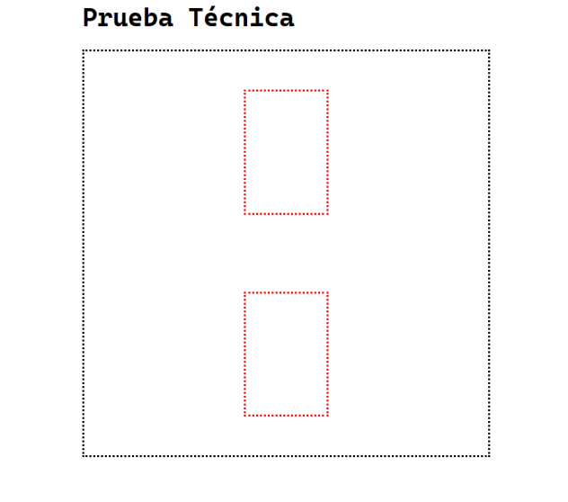
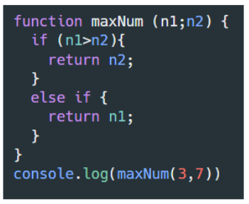
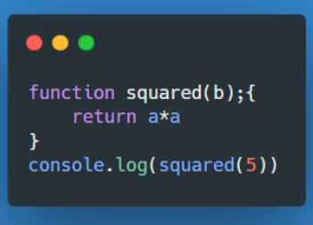
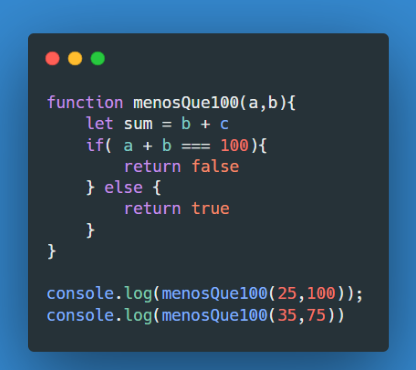

# **PRUEBA TECNICA**

## **HTML CSS & BOOTSTRAP**

1. ¿Cuál es el propósito principal de CSS?: 
- El proposito principal es, darle esa parte visual a nuestra pagina web, como nuestro estilo unico y orignal de cada uno de nosotros.

2. ¿Cuál es la diferencia entre margin y padding en CSS?: 
- El margin te brinda el estilo entre margenes, imagenes. Mientras que el padding es base a los bordes como el redondeado.

3. ¿Qué es Bootstrap?: Un framework de CSS creado por twitter que nos ayuda acelerar el diseño de nuestra pagina web.

4. ¿Cuál es la etiqueta correcta para enlazar un archivo de hoja de estilos externo en un documento HTML?
-  `<link href="">` es la etiqueta que nos permite la conexion entre archivos css con html 

5. ¿Qué es una clase CSS y cómo se selecciona en un documento HTML?: 
- Una clase es un selector que nos ayuda a personalizar una parte del html, la utilizamos siempre iniciando con .nombre-de-la-clase{} y en thml agregamos la propiedad class

6. ¿Qué es un diseño web responsivo (responsive design)?: 
- Es la adaptabildidad que tiene nuestra pagina web, en los diferentes tamaños de pantalla como telefonos, tabletas, computadoras.


7. En tan solo 3 líneas de código en tu css indica cómo harías para posicionar los cuadros rojos justo en medio de un contenedor, como se muestra en la siguiente imágen, (si es necesario crea el index)

    
- index.html
    ``` 
    <!DOCTYPE html>
    <html lang="en">
    <head>
        <meta charset="UTF-8">
        <meta name="viewport" content="width=device-width, initial-scale=1.0">
        <link rel="stylesheet" href="./styles.css">
        <title>Test</title>
    </head>
    <body>
        <section style="border: 1px solid;">
            <div class="center"></div>
            <div class="center"></div>
        </section>
    </body>
    </html>
    ```
- styles.css
    ```
    /*Estilos para que se vean los div*/
    div {
        border: 1px solid black;
        width: 100px;
        margin: 10px;
        height: 100px;
    }

    /*Estilos para centrar los div*/
    section{
        display: grid;
        justify-content: center;
    }
    ```

8. Encuentra y corrige los errores:

    

    - Hay un `;` en `function maxNum (n1;n2)`
    - Ambos  `return` nos dan un valor invertido, si lo pensamos bien en la primera decisión nos devuelve  `n2` y en la segunda desicion nos retorna `n1`, lo cual deberia ser al reves
    - hay un `if` de mas en `else if {return n1}`

    <br/>

    

    - En la parte **`squared(b)`** existe un **`;`**
    - Tambien si nos damos cuenat nos retorna **`a*a`**  lo cual esta indefinido ya que en `squared()` se declara `b` y no `a`
    
    <br/>

    

    - Encontramos que en la parte `let sum = b + c` hay una variable c que no esta definida en los parametros de la funcion `menosQue100` lo cual ocasionaria un error.
    - Ademas de que no utilizamos la variable `sum` en la decision `if( a + b === 100)`


## **JavaScript**

### **Parte teórica**

1. Pregunta: ¿Qué es JavaScript?: 
- Es un lenguaje de programacion que nos permite crear animaciones, interacciones con el usuario, funciones, ciclos, ademas  se aloja del lado del cliente "Navegador"

2. Pregunta: ¿Cuál es la diferencia entre "null" y "undefined" en JavaScript?:
- Null: no existe como tal el valor, en el codigo   Undefined: nos indica que un valor no esta definido 

3. Pregunta: ¿Cómo se declara una variable en JavaScript?:
-  En Java Script tenemos tres tipos de variables var, let y const, si ponemos una variable sin alguna de estas tres en automatico lo toma como var. Para declararla es simple nombre_variable = valor de la variable ejemplo :  x = 10 o x = "hola"

4. Pregunta: ¿Qué es una función en JavaScript?: 
- Es un bloque de codigo que hace una tarea en especifica por ejemplo sumar, restar, saludar

5. Pregunta: ¿Cuál es la diferencia entre "==" y "===" en JavaScript?: 
- La diferencia es que el si utilizamos `==` es como un `o` significa que `a` es igual que `b` `a==b` , mientras que si utilizas el `===`, compara que las variables que estén siendo comparadas tengan el mismo valor **y** el mismo tipo de variable. 
    - Ejemplo:
    ```
    const numero = 1234 
    const numeroComoCadenaDeTexto = '1234'  

    console.log(numero == numeroComoCadenaDeTexto) //true
    console.log(numero === numeroComoCadenaDeTexto)  //false
    ```
    **El valor de numero y numeroComoCadenaDeTexto se ven similares aquí. Sin embargo, el tipo de numero es Numero y el tipo de numeroComoCadenaDeTexto es Cadena. Incluso si los valores son el mismo, el tipo no es el mismo. De ahí que una verificación con == devuelva true, pero cuando se comprueba tanto el valor y el tipo, arroja false (falso).**

6. Pregunta: ¿Qué es el DOM (Document Object Model) en JavaScript?: 
- Es la parte que nos permite manipular crear, cambiar, o remover elementos HTML desde Javascript. También podemos agregar eventos a esos elementos para hacer más dinámica nuestra página.


### **Parte Práctica**

**Ejercicio 1:**
- Escribe una función que tome una cadena de texto como parámetro y devuelva un objeto con cada palabra de la cadena como propiedad y el número de veces que aparece como valor.

```
    const palabras = cadena.split(' ');
    const resultado = {};
    

    palabras.forEach(palabra => {
       
        resultado[palabra] = (resultado[palabra] || 0) + 1;
    });

    return resultado;
    }


    console.log(contarPalabras("Saludar"))
    console.log(contarPalabras("Saludar"))
    console.log(contarPalabras("Saludar"))
```

**Ejercicio 2:**
- Completa el siguiente código para que, al hacer clic en el botón, se muestre un mensaje que diga "¡Hola desde JavaScript!".

```
 <!DOCTYPE html>
    <html lang="en">
    <head>
        <meta charset="UTF-8">
        <meta name="viewport" content="width=device-width, initial-scale=1.0">
        <title>Prueba Técnica</title>
    </head>
    <body>
        <button id="boton">Haz clic aquí</button>

    <script>
        document.getElementById("boton").addEventListener("click", function() {
        alert("Hola desde JavaScript");
    });
    </script>
        
    </body>
    </html>
```


**Ejercicio 3:**
- Desarrolla una función que tome un número entero positivo como parámetro y devuelva el factorial de ese número. 

    - Ejemplo:
    - factorial(5) => 5 * 4 * 3 * 2 * 1 = 120
```
function factorial(numero) {
    if (numero === 0 || numero === 1) {
      return 1;
    } else {
      return numero * factorial(numero - 1);
    }
  }
  
  const numero = 5;
  const resultado = factorial(numero);
  console.log(`El factorial de ${numero} es ${resultado}`); 
```

**Ejercicio 4:** 
- Escribe una función que tome un array de strings como parámetro y devuelva un nuevo array con las mismas palabras, pero ordenadas alfabéticamente de forma 
ascendente.

    - Ejemplo:
    - ordenarPalabras(["manzana", "banana", "pera", "uva"]) => ["banana", "manzana", "pera", "uva"]

```
function ordenarPalabras(arrayDeStrings) {
    return arrayDeStrings.slice().sort();
  }
  
  const palabrasDesordenadas = ["manzana", "banana", "pera", "uva"];
  const palabrasOrdenadas = ordenarPalabras(PalabraDesordenadas);
  console.log(palabrasOrdenadas); 
```
